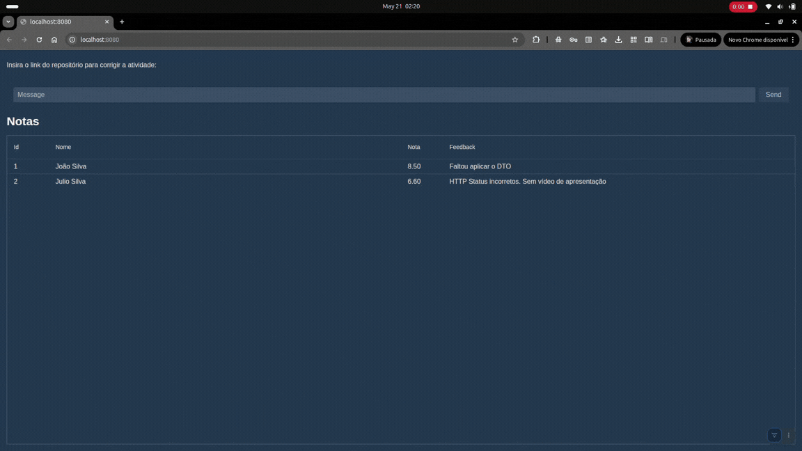

# Decisões de Projeto

##### Tarefa 3 — AssessmentTools
- As ferramentas de criação e atualização de avaliações foram separadas em uma classe específica (AssessmentTools), mantendo a lógica fora da interface e evitando acesso direto ao repository.

- A implementação reutiliza o AssessmentService, pra focar na persistência e evitar duplicação do código. 

#### Decisão adotada
- separação das tools em serviço próprio;
- reutilização da camada service;
- uso de Builder para criação da entidade;
- atualização simples e objetiva da avaliação.

#### Potencial melhoria
A atualização da avaliação percorre toda a lista de avaliações para localizar um único registro com o getAllAssessments().stream()

Um uso melhor seria adicionar um método findById() no service para buscar direto pelo ID.

##### Tarefa 4 — ShellToolsService
- A ferramenta de clonagem de repositórios foi implementada utilizando ProcessBuilder, permitindo executar o comando git clone

#### Decisões adotadas
- uso de ProcessBuilder ao invés de Runtime.exec;
- criação automática do diretório base de repositórios;
- separação da lógica de extração do nome do repositório;
- tratamento básico de erros e código de saída do processo.

#### Potencial melhoria
Separar o tratamento de InterruptedException
IOException para aplicar Thread.currentThread().interrupt() apenas em casos de interrupção da thread.

##### Tarefa 5 — FileSystemToolsService
As ferramentas de sistema de arquivos foram separadas em dois comportamentos principais:

- listagem recursiva de arquivos;
- leitura de conteúdo de arquivos.

#### Decisões adotadas

- responsabilidade única para cada método;
- recursividade isolada em método auxiliar;
- uso de Files.readString() para simplificar leitura de arquivos;
- retorno de caminhos relativos para facilitar navegação do agente.
#### Potencial melhoria

Adicionar validação de caminhos utilizando Path.normalize() para impedir acessos inválidos com caminhos relativos como:

../../arquivo

##### Tarefa 6 — Skills
O prompt de correção ficou em Markdown (project-review-skill.md), desacoplando isso do código Java.

#### Decisões adotadas
- armazenamento da skill em arquivo externo;
- carregamento via ClassPathResource;
- instruções curtas e objetivas;
- definição clara das responsabilidades do agente.

O objetivo foi evitar overengineering no projeto, usando boas práticas e simplicidade.

#### Adicional necessário:
- Foram injetados na HomeView os serviços AssessmentTools, ShellToolsService, FileSystemToolsService e SkillsService, permitindo que a lógica de correção seja disparada diretamente a partir da ação do usuário.

- O método runReview passou de uma notificação estática para um fluxo completo: clona o repositório informado, lista arquivos relevantes, carrega os parametros de correção e registra uma nova avaliação (nota e feedback) no banco.

- Foram adicionados métodos auxiliares para resumir o texto das skills e truncar o feedback, garantindo que a mensagem exibida ao usuário seja compatível com o limite de tamanho da coluna no banco de dados.

`Importante:`

Criei um serviço ReviewService que integra o projeto com o Spring AI + Anthropic, usando ChatClient para gerar automaticamente nota e feedback com base nas diretrizes de correção e na estrutura de arquivos do repositório.

Adicionei a configuração AiConfig para expor um bean de ChatClient a partir do ChatModel fornecido pelo starter Anthropic, permitindo injeção transparente do cliente de chat em outros serviços.

Na HomeView, o construtor passou a receber também o ReviewService, e o metodo runReview foi atualizado pra clonar o repositório, chamar o agente (ReviewService.generateFeedback), extrair nota e feedback do texto retornado e registrar a avaliação via AssessmentTools, atualizando em seguida o grid de notas.

O .gif no inicio do README não mostra essas últimas alterações por um problema com a API Key da Antropic, portanto não foi possível fazer um segundo .gif demo.